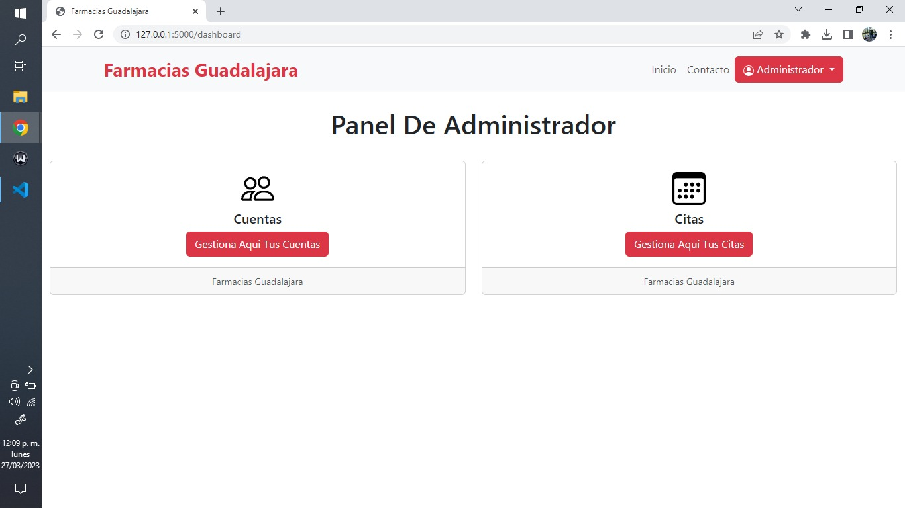
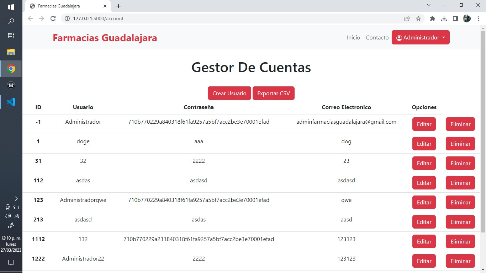
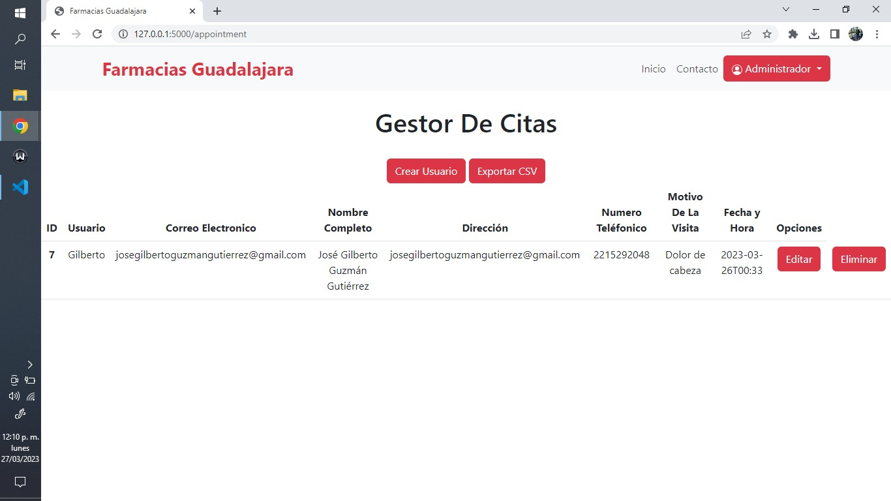

## Realizar el Siguiente Modulo de Citas en python (Avances del Proyecto)

 

### Ahora mismo ya esta disponible el gestor de cuentas y citas (CRUD), para acceder a ellos vas a requerir logearte con la cuenta de administrador, caso contrario, seras redirigido a la dirección "/home", y por ende tambien ya esta disponible los formularios respectivos para que el usuario pueda agregar sus datos.

### Nota: Aun se esta trabajando en el ordenamiento y optimización del codigo.

### Repositorio.

    https://github.com/Gilberto-Guzman/Farmacias-Guadalajara

### Capturas.

##### 1.-

##### 2.-

##### 3.-

##### 4.-

