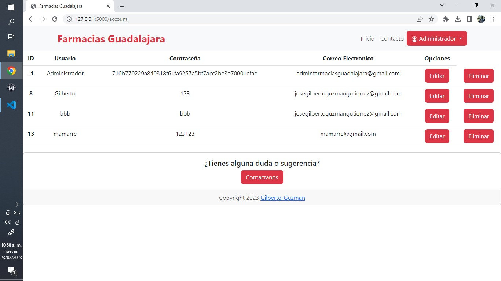
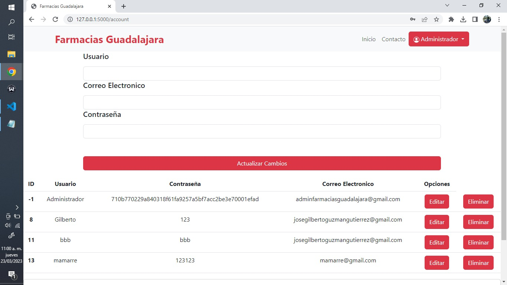
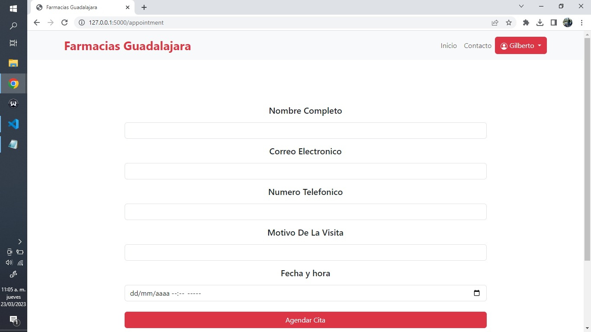

## Crear un CRUD Paciente Python+flask (Avances del Proyecto)

 

### Actualmente se esta trabajando en el gestor de cuentas y en la gestion de citas, se pretende que durante el transcurso de estos dias se lanze una actualización la cual añada todas las funcionalidades correspondientes y afine divesos aspectos del CRUD.

### Repositorio.

    https://github.com/Gilberto-Guzman/Farmacias-Guadalajara

### Capturas.

##### 1.-

##### 2.-

##### 3.-

