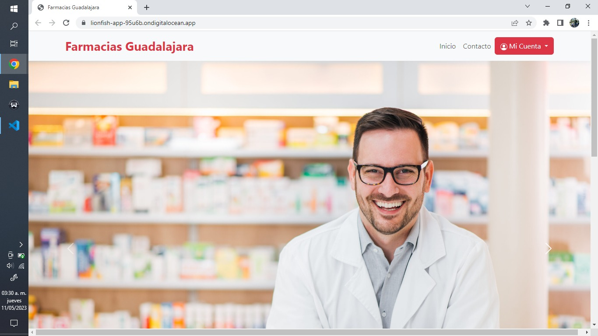
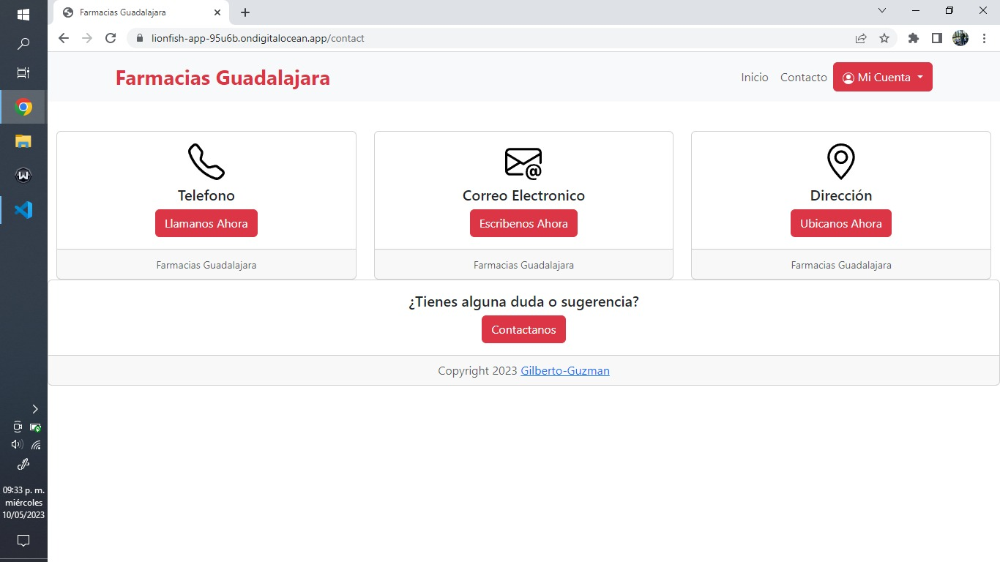
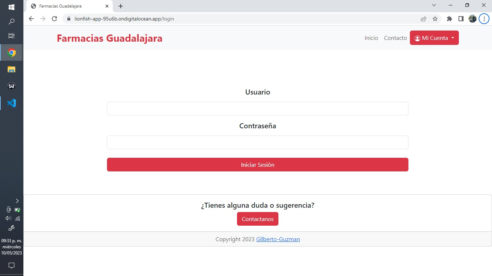
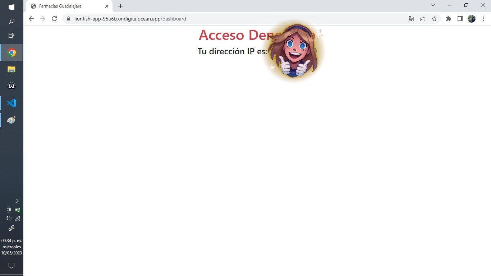
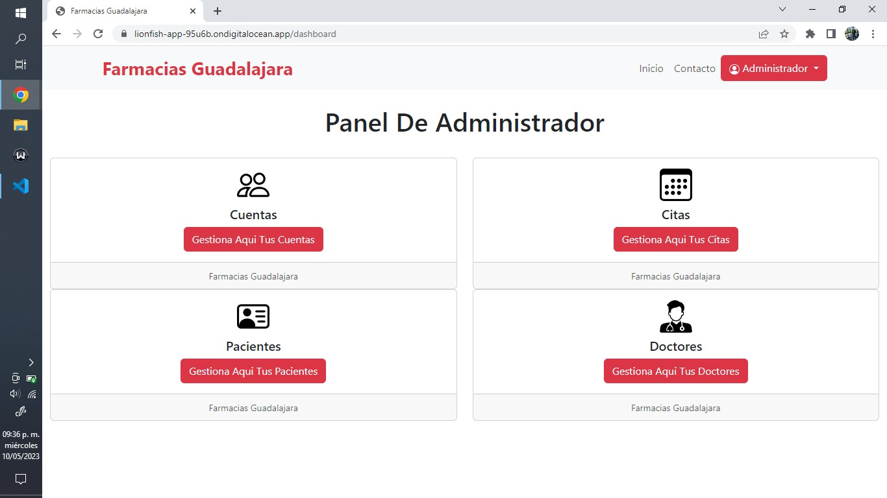
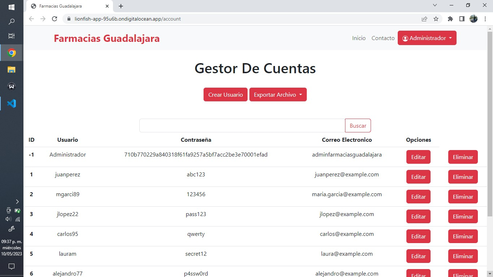
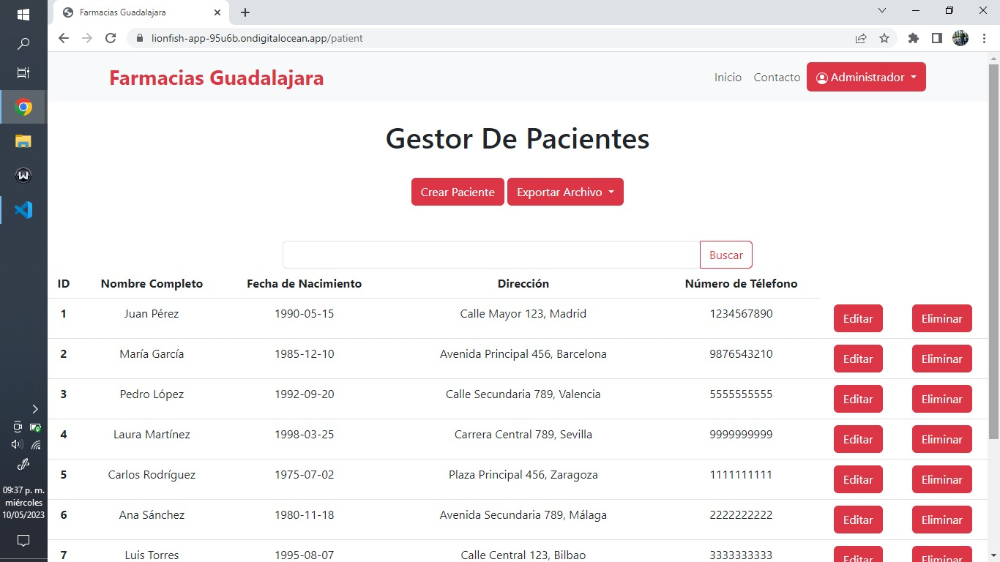
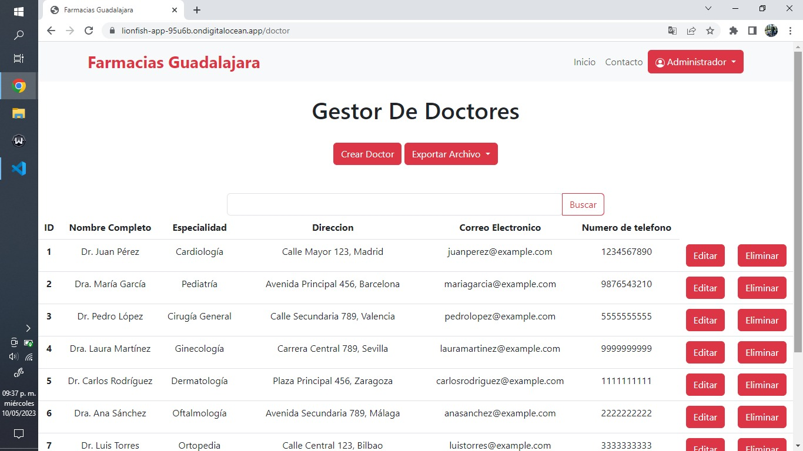
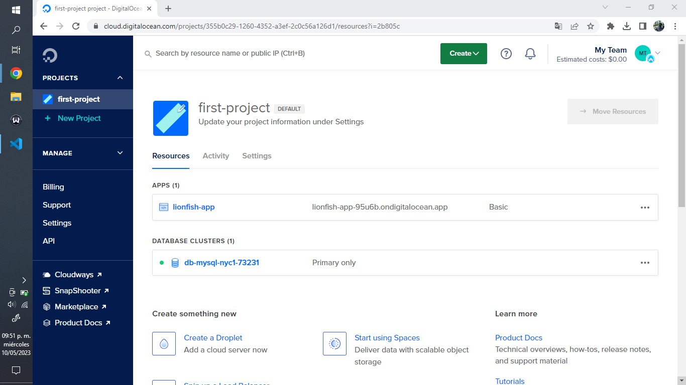

# Proyecto web final de clínica de Especialidades en un VPS.

## 1. En equipo deberá seleccionar el mejor diseño y la aplicación de clínica de especialidades.

Hemos escogido presentar la aplicación web inspirada en Farmacias Guadalajara, la cual esta conformada de los siguientes elementos:

- ### Página de inicio.

  

- ### Anexo de contácto.

  

- ### Login de acceso.

  

- ### Protección de acceso al contenido.

  

- ### Panel de administrador.

  

- ### Gestor de cuentas.

  

- ### Gestor de citas.

  

- ### Gestor de pacientes.

  

- ### Gestor de doctores.

  

## 2. Subir esa aplicación a un VPS(Servidor Privado Virtual)

Utilizamos DigitalOcean para hostear tanto nuestra aplicación web como nuestra base de datos.

Todo ello gracias al apoyo de Microsoft Github Student Development Pack.

## 3. Enviarme el URL que si funciona , presentarmelo por equipo....

Integrantes del equipo:

- José Gilberto Guzmán Gutiérrez - A200119
- Bryan Andrew Castro Valencia - A200728
- Cristian Gutiérrez Hernández - A200256
- José Julián Molina Ocaña - A200002
- Fernando De Jesús Sánchez Arias - A200731

Actualmente ya puede acceder a nuestra aplicación web mediante el siguiente enlace:

    https://lionfish-app-95u6b.ondigitalocean.app/

Adicionalmente, puede checar el codigo fuente mediante este otro enlace:

    https://github.com/Gilberto-Guzman/Farmacias-Guadalajara
