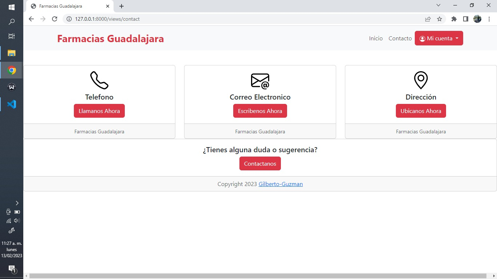

## Act. 1.6 Crear un Proyecto Web de una Clínica de Especialidades .-Instalar Flask en python crear html + css.

 

### Repositorio.

    https://github.com/Gilberto-Guzman/Farmacias-Guadalajara

### Capturas.

##### 1.-

##### 2.-

##### 3.-

##### 4.-

